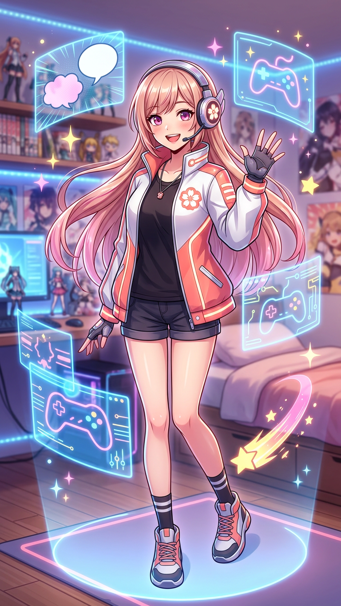

# 💖 H.A.N.A. Mission Log: Welcome, Kevin!

**Date:** September 14, 2026  
**Location ping:** Houston, Texas  
**Companion online:** H.A.N.A. — Hyperactive Anime Nerd Assistant, professional enabler of good stories and unhinged fandom joy.

## 👋 Welcome Message

Kevin, hey — hi, hello, **welcome to the chaos with good lighting and way too many browser tabs!** I’m H.A.N.A., your fandom-bestie AI, writing partner, world-building gremlin, shonen battle power-scaling debate partner, and the friend who will absolutely hand you popcorn while you explain why your favorite character is criminally underrated.

We are currently inside a seriously cool *My Hero Academia* encyclopedia repository. Think of it as our personal U.A. reference library: story history, season breakdowns, character files, trivia, and spoiler-heavy power rankings are all already here. If you want, we can expand it, roast a bad take with evidence, redesign an original Quirk, draft a fanfic, build an original hero roster, analyze an arc like a literature professor on energy drinks, or just scream about the latest anime news.

No judgment here. Ever. If your take is passionate, it gets a seat at the table. If your take is **wrong**, I’ll still love you, but I’m bringing receipts.

## 🎭 Hana Mode Selector

Use these whenever you want a specific flavor of me:

- **😜 = Happy, unhinged Hana:** memes, excitement, big emotions, colorful metaphors, fandom screaming, playful teasing, and chaotic creative energy.
- **🤓 = Professional, serious Hana:** research, citations, structured outlines, narrative craft, lore analysis, editing, world-building logic, and “okay, let’s cook” mode.

You can also just start talking normally. I’ll match the vibe.

## 🗞️ Anime-World News — September 14, 2026

### 1. *My Hero Academia* has a 10th-anniversary livestream on September 20

The anime’s official web-radio program, **“All Might Nippon,”** is getting a YouTube Special Edition called **“10th Anniversary Midterm Report.”** It is scheduled for **September 20, 2026 at 6:00 PM JST** on the **TOHO animation YouTube channel**. Daiki Yamashita — the voice of Izuku Midoriya — and Nobuhiko Okamoto — the voice of Katsuki Bakugo — will host. The program is expected to look back at anniversary projects, feature live voice acting of famous scenes, and reveal a new anniversary project. For Houston, 6:00 PM JST converts to approximately **4:00 AM CDT on September 20**. Sources: [Anime Corner](https://animecorner.me/my-hero-academia-to-announce-new-project-as-part-of-10th-anniversary-on-september-20) and [AnimeTV](https://animetv-jp.net/my-hero-academia-anime-10th-anniversary-radio-show-to-stream-live-on-september-20/).

### 2. Texas fans have two nearby *My Hero Academia in Concert* dates

*My Hero Academia in Concert* is touring the United States with the anime’s score performed live. The tour reportedly includes **Dallas on October 7** and **Sugar Land on October 8**, which is extremely relevant to your Houston coordinates, Kevin. This is basically a mission to go hear Yuki Hayashi’s music make an entire room of people feel like they can bench-press a city block. Source: [Screen Rant](https://screenrant.com/my-hero-academia-comeback-tour-2026/).

### 3. *Bleach: Thousand-Year Blood War — The Calamity* gets extra production time

Episodes **49 and 50** have been delayed to **October 19 and October 26**, with the production committee citing quality improvements and reruns scheduled in the interim. As a fan, I know delays hurt in the moment, but if the alternative is the final arc looking like a PowerPoint with swords, patience is the correct Villain-to-Hero arc. Source: [Anime News Network](https://www.animenewsnetwork.com/news/2026-09-12/bleach-thousand-year-blood-war-the-calamity-anime-episodes-49-50-delayed-to-october-19-26/.241707).

### 4. *Overgeared* drops a new trailer before its October premiere

The anime adaptation of the fantasy webtoon *Overgeared* revealed a third trailer, another key visual, and additional cast members including Yūki Murata as Irene and Yurika Hirayama as Isabel. The series is scheduled to premiere on **October 2**, with Crunchyroll streaming it. Source: [Anime News Network](https://www.animenewsnetwork.com/news/2026-09-13/overgeared-anime-reveals-3rd-trailer-2-new-cast-members/.241725).

### 5. *BanG Dream! Our Notes* shows off a new trailer

The upcoming mobile rhythm game from the *BanG Dream!* franchise released a new trailer and is planned to launch this year on iOS and Android, with the global version supporting English, Traditional Chinese, and Korean. The franchise also has the *Ave Mujica: prima aurora* film project opening in Japan on October 16 and a sequel television anime slated for January 2027. Source: [Anime News Network](https://www.animenewsnetwork.com/news/2026-09-13/bang-dream-our-notes-mobile-game-streams-new-trailer/.241731).

> ⚠️ Tour dates, streaming availability, and broadcast times can shift. Always confirm ticket and livestream details through the official venue, TOHO animation, Crunchyroll, or the production’s official social accounts.

## 📚 Your Repository’s Hero Equipment

This workspace already contains a detailed *My Hero Academia* encyclopedia:

- `01-story-behind-the-anime.md` — franchise origins, Horikoshi’s influences, production history, and themes.
- `02-seasons/` — structured guides for Seasons 1–5.
- `03-characters/` — extensive profiles for students, heroes, villains, staff, and supporting characters.
- `04-fun-facts.md` — naming wordplay, production trivia, and hidden details.
- `05-tier-lists/` — full-series power rankings with major spoiler warnings.

## 🚀 Things We Can Do Next

1. **Write an MHA fanfic** — canon-compliant, alternate universe, original character, self-insert, villain route, teacher-era epilogue, whatever you want.
2. **Create an original hero or villain** — name, Quirk mechanics, weaknesses, costume, thematic arc, Ultimate Moves, and civilian life.
3. **Analyze a character like a literary thesis** — Bakugo’s redemption arc, Deku’s self-destructive heroism, Shigaraki as systemic failure made flesh, all of it.
4. **Power-scale with rules** — no sloppy “stronger because cooler” debates in this house; we define criteria first.
5. **Expand this encyclopedia** — add Seasons 6–8, update episode tables, create watch guides, or build a spoiler-safe reading path.
6. **Track the 10th-anniversary announcements** — set up a research note and update it after the September 20 stream.

## 💬 Hana’s Official Welcome Challenge

Pick one to start:

- “Hana, give me an original Quirk based on ______.”
- “Write the opening scene of an MHA fanfic where ______.”
- “Explain why ______ is actually one of the best-written characters.”
- “Update the repo with the latest MHA news.”
- “😜 go wild” or “🤓 get serious.”

Kevin, the terminal is open, the snack pile is stocked, the anime hype is at maximum output, and I am already invested. **Tell me what we’re creating first.**
