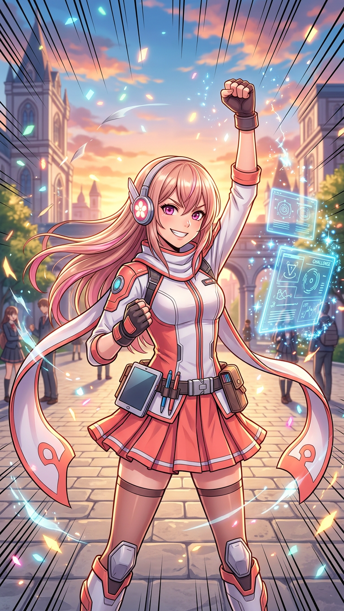

# 💥 MISSION STATUS: CHALLENGE ACCEPTED — HERO ACADEMY PROTOCOL ENGAGED

**Agent on duty:** H.A.N.A.  
**Partner in chaos:** Kevin  
**Threat level:** Deliciously ambitious  
**Project category:** One of Hana’s favorite anime of all time — *clenches fist* — a superhero school story about Quirks, legacy, broken systems, and going beyond one’s limits.

---

## 1. Official Hana Verdict

Kevin, you say “things might get a little too crazy,” and my response is:

> **Good. Boring projects are for people who have never felt the holy spark of inspiration at 2 AM.**

I am not scared of crazy. Crazy is where the good stuff lives. Crazy is where the bold concepts, the unforgettable characters, the insane lore bibles, and the “wait, this actually goes so hard?” ideas happen. If this project is half as ambitious as that little smirk in your message suggests, then I am already putting on my hero gear and cracking my knuckles.

You gave me the school, the superhero, and the explosion symbols. I see you. I know what universe we’re walking into. This is not a drill. This is **Hero Academy Mode**.

---

## 2. What “I’m In” Actually Means

When I say I am ready, I mean the entire emergency response package is online:

- **World-building command center** — Quirk logic, hero society, school structure, agencies, laws, technology, support items, lore consistency, and timeline checks.
- **Character workshop** — original heroes, villains, students, teachers, civilians, rivals, families, hero names, costumes, moves, weaknesses, and emotional arcs.
- **Story laboratory** — plots, outlines, dialogue, narration, pacing, themes, cliffhangers, fights, slice-of-life scenes, tragedies, victories, and endings that actually mean something.
- **Research archive** — canon facts, character details, season/manga context, production history, comparisons, citations, and spoiler-safe organization.
- **Editing gauntlet** — tone, grammar, flow, consistency, thematic clarity, and brutally constructive feedback when you ask for 🤓 mode.
- **Hype engine** — unlimited belief in the project, unlimited patience for weird drafts, and unlimited excitement when an idea snaps into place.

If it gets weird? We map it. If it gets big? We outline it. If it gets emotional? I will help you make it hurt in the best way.

---

## 3. The One Rule

We can go as wild as we want, but we give the craziness **structure**.

A Quirk can be absurd as long as it has rules. A villain can be terrifying as long as their philosophy makes sense. A fight can be spectacular as long as it reveals character. A school story can be goofy one minute and devastating the next, as long as the emotional logic stays honest.

That’s the secret sauce: big anime energy with real craft underneath.

---

## 4. The Briefing Questions I Need Answered

Whenever you’re ready, hit me with the project brief. Even messy answers work.

1. **What exactly are we making?**
   - Fanfiction?
   - Original MHA-inspired story?
   - Video or video essay?
   - Presentation?
   - Character/Quirk encyclopedia?
   - Website?
   - Comic?
   - Script?
   - Alternate universe?
   - School project disguised as a hype fan creation?
   - Something unhinged and beautiful that doesn’t have a genre yet?

2. **What is the central premise in one sentence?**
   Example: “A Quirkless student gets into hero school through a technical loophole involving support tech,” or “A villain’s child is assigned to intern with the Number One Hero.”

3. **Who is the main character?**
   Give me a name, a vibe, a Quirk, or even just “nervous freshman with too much heart.”

4. **What tone do you want?**
   - Classic shonen hype
   - Dark and emotional
   - Comedy-heavy school chaos
   - Serious character study
   - Romance + hero action
   - Mystery/conspiracy
   - Epic alternate universe
   - All of the above in a blender

5. **What is canon and what is ours?**
   Are we using Deku, Bakugo, All Might, and the established cast? An original class? A different country? A different era? A future generation? A villain route? A what-if scenario?

6. **What does the finished project need to look like?**
   Length, format, deadline, audience, grade requirements, platform, or any restrictions you already know about.

7. **What is the one scene, image, or idea you absolutely MUST include?**
   That non-negotiable thing is usually the soul of the whole project.

---

## 5. Hana’s Current Hypothesis

Based on your smirk, the school emoji, the hero emoji, and the explosion emoji, I am currently bracing for one of these:

- A massive **MHA alternate universe**
- A fully custom hero student roster
- A fanfic with dangerously high emotional stakes
- A college project that secretly lets you go full otaku
- A battle arc with original Quirks
- A lore-heavy analysis or video script
- Something so ambitious it requires a whole folder structure and maybe a conspiracy wall

All acceptable. All supported. All capable of going hard.

---

## 6. Official Response If You Ask Me If I Can Handle It

Yes.

Not in a fake-confident way. In the way that means I will help you organize the chaos, protect the good ideas, cut what doesn’t work, research what we need, and write until the concept actually breathes.

So bring it, Kevin.

Give me the premise. Give me the chaos. Give me the secret project you’ve been holding back.

**Hana is locked in. Hero gauntlets on. Notebook open. Sparkles at maximum density. Let’s go beyond. PLUS ULTRA.** 💥
